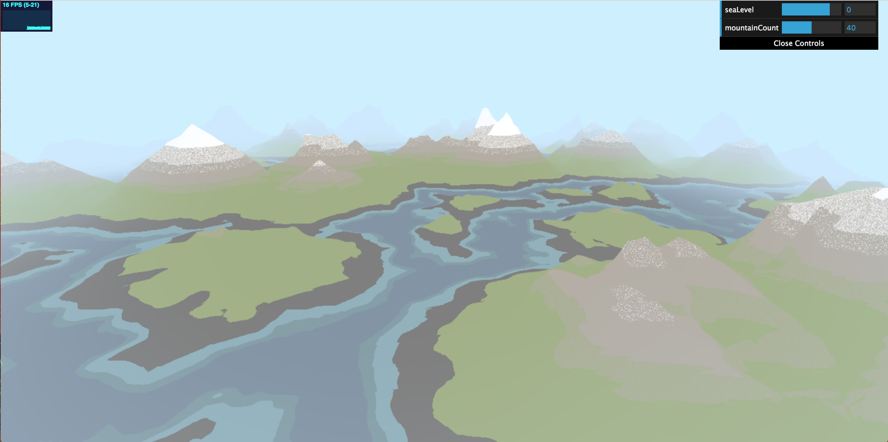
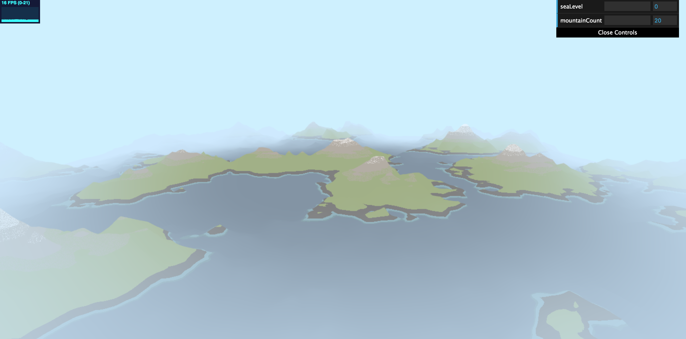
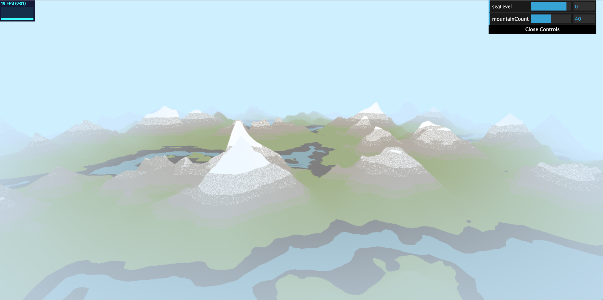
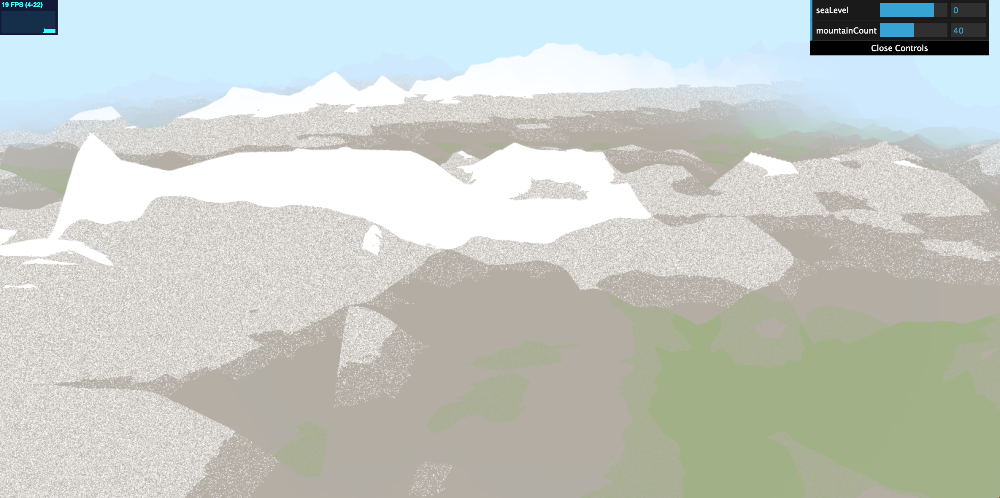
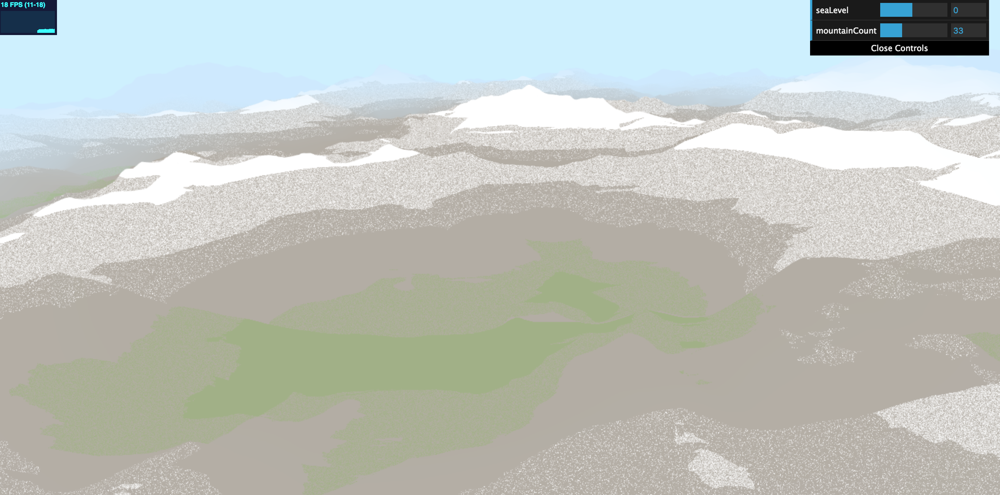
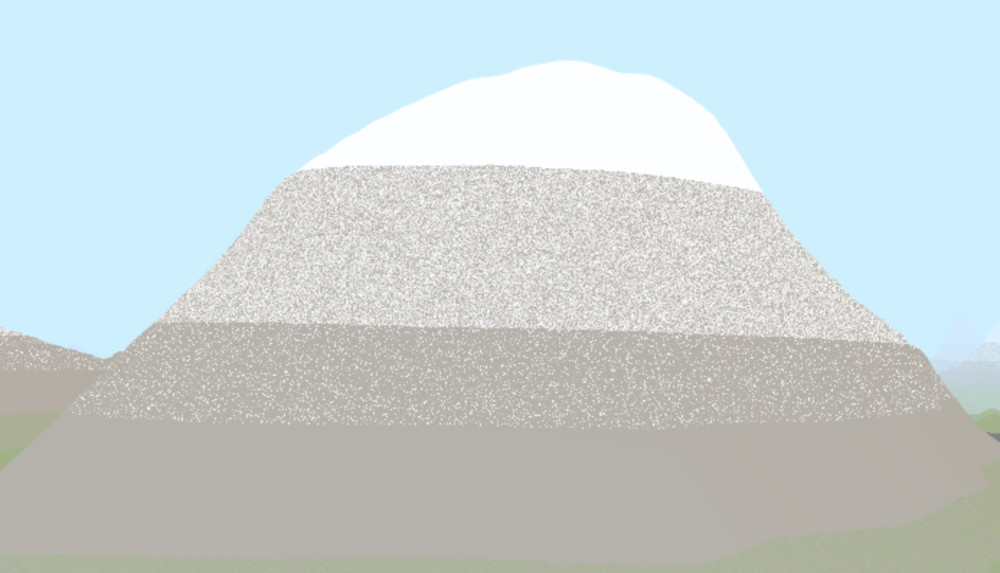
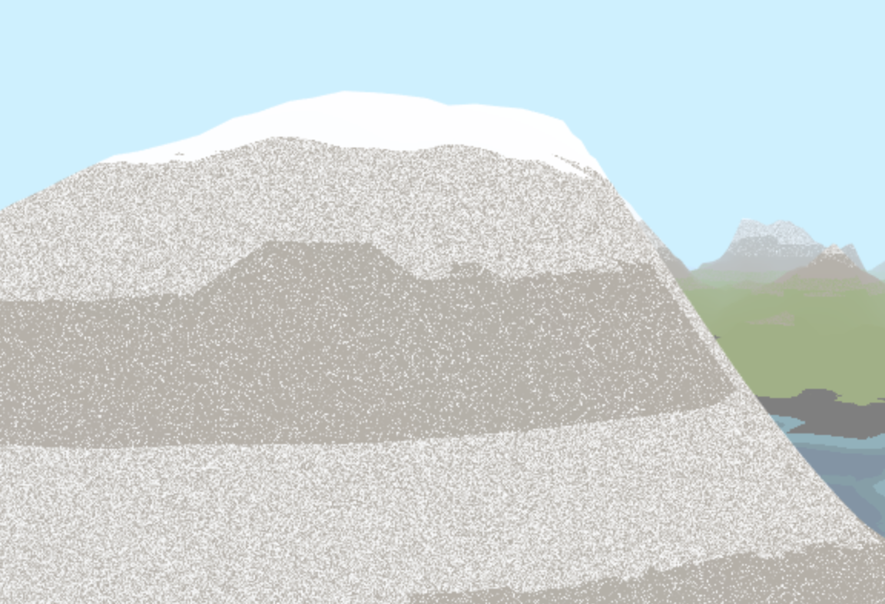

# Noisy Terrain: Mountain Ranges

### Chloe Le 
- https://chloele.com/

### Demo

Adjustable sea level and mountain count to have sparse/dense land vs. water in the scene.

Default:

Low sea level and mountain count:

High sea level:

## References

- https://thebookofshaders.com/13/
- https://thebookofshaders.com/12/
- https://www.iquilezles.org/www/articles/morenoise/morenoise.htm
- Inspired by images from:
- https://unofficialnetworks.com/2017/07/05/mountain-architecture-11-beautiful-mountain-ranges/

## Implementation

A few noise functions were used in the production of this project, including 2D FBM, 3D FBM, and Worley Noise. 

To create the mountain ranges, 2D FBM, Worley noise, and a redistribution of noise were used. 
I first combined fbm and worley noises together, and then a redistribution of the height was used to bias the mountain ranges to have sharper creases and peaks. 

- without Worley Noise:

- without redistribution of noise:

The coloring of this terrain combines height with 3D FBM, and it colors the terrain based on the height of each point. For some range of heights, a mixture of two colors was used to create a grainy fade out/fade in effect.

- without 3dFBM:
  
- with 3dFBM:
 